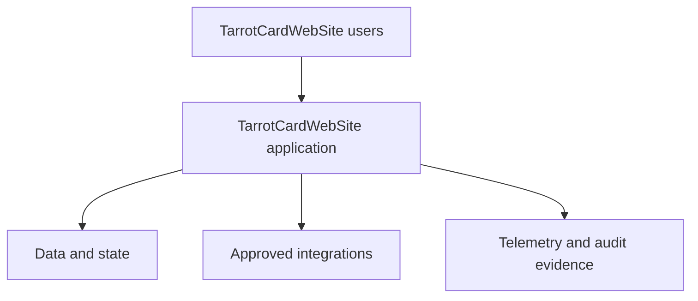

# Architecture

> TarrotCardWebSite · Platform · Pre-Alpha

TarrotCardWebSite is cataloged as a Platform application focused on interactive card-reading experiences.

> **Baseline notice:** This document defines the expected operating standard. It does not claim that a control, integration, model, or certification is already implemented; verify the code, configuration, and production evidence before release.

## System context

The application boundary owns orchestration of interactive card-reading experiences. It handles the lifecycle **start session → select cards → interpret → review** while external identity, storage, messaging, analytics, or ecosystem services remain explicit dependencies.

## Logical layers

| Layer | Responsibility |
| --- | --- |
| Experience | Validate intent, present state, accessibility, and recovery paths |
| Application | Enforce workflow rules, authorization, and idempotency |
| Domain | Represent reading state and invariants |
| Adapters | Isolate persistence and third-party contracts |
| Operations | Emit health, performance, security, and audit signals |

## Architecture rules

- Trust no client-supplied identity, role, amount, status, or derived result.
- Keep secrets and privileged credentials outside client bundles and source control.
- Version externally consumed contracts; validate inputs and outputs at boundaries.
- Separate operational telemetry from sensitive content.
- Preserve provenance for material transformations and decisions.
- Degrade safely when a dependency is slow, unavailable, or inconsistent.

## Current-state validation

Treat this as the target boundary model. Confirm actual modules, hosting, data stores, authentication, queues, scheduled work, and external dependencies from repository and environment evidence, then record differences in an ADR.
