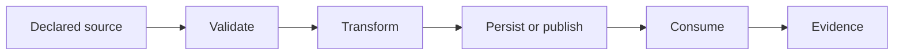

# Data Lineage

> TarrotCardWebSite · Platform · Pre-Alpha

TarrotCardWebSite is cataloged as a Platform application focused on interactive card-reading experiences.

> **Baseline notice:** This document defines the expected operating standard. It does not claim that a control, integration, model, or certification is already implemented; verify the code, configuration, and production evidence before release.

## Lineage path

For TarrotCardWebSite, likely data classes include session choices, card content, generated interpretations, and minimal telemetry. Each material field or derived result must be traceable to a source, collection time, validation rule, transformation version, destination, retention rule, and accountable owner.

## Lineage record

| Attribute | Required value |
| --- | --- |
| Source | System, user action, file, sensor, or provider |
| Classification | Public, internal, confidential, restricted |
| Legal/contract basis | Recorded where applicable |
| Validation | Schema, range, freshness, and authenticity checks |
| Transformation | Code/rule/model version and parameters |
| Destination | Store, topic, API, report, or user surface |
| Retention | Duration and deletion/anonymization trigger |
| Evidence | Correlation ID and immutable event reference |

## Quality controls

Reject or quarantine malformed input; never silently coerce a material value. Track freshness, completeness, validity, duplication, and reconciliation. Derived decisions must expose uncertainty and provenance appropriate to their impact.
