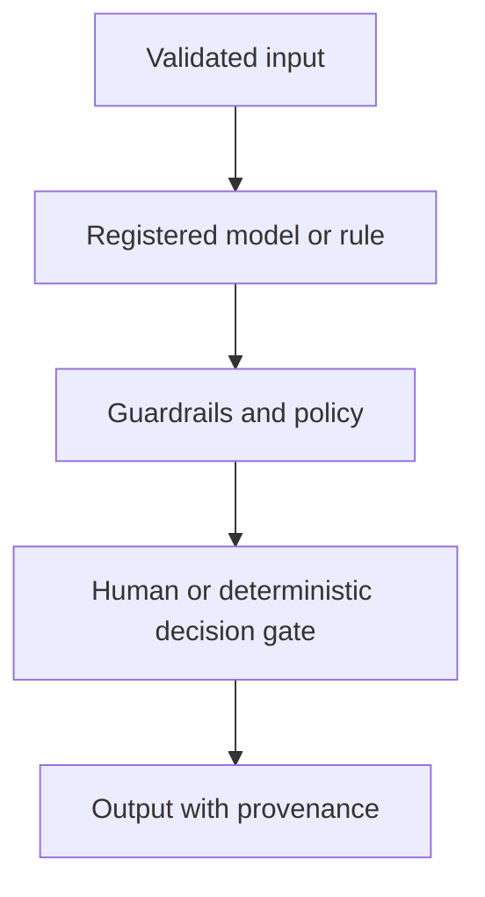

# AI Architecture

> TarrotCardWebSite · Platform · Pre-Alpha

TarrotCardWebSite is cataloged as a Platform application focused on interactive card-reading experiences.

> **Baseline notice:** This document defines the expected operating standard. It does not claim that a control, integration, model, or certification is already implemented; verify the code, configuration, and production evidence before release.

## Applicability

No AI dependency is established by this baseline. If AI is introduced, the registry and governance gates in this section become mandatory.

## Controlled pattern

AI components must sit behind a typed application boundary. They receive minimized, authorized input; use an approved model and prompt/configuration version; emit structured output with uncertainty; pass safety and policy checks; and retain enough evidence for review without logging restricted content.

## Failure behavior

- Reject malformed or policy-disallowed input before inference.
- Set latency and cost limits; do not retry indefinitely.
- Treat output as untrusted until validated.
- Provide a non-AI or human-review path for high-impact decisions.
- Never let a model grant permissions, move value, or change governed state without an authorized deterministic gate.
- Monitor drift, quality, safety, and provider incidents.

## Required decisions

Before enabling AI, record use case, owner, impact tier, provider and model, data use terms, evaluation set, acceptance thresholds, human oversight, fallback, retention, and disable switch.
